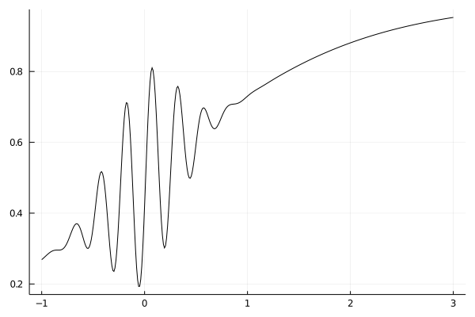
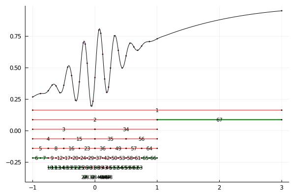

# Simpson Adaptivo

A estratégia de Simpson Adaptivo (ou adaptativo) é refinar intervalos conforme o necessário. Antes vamos falar um pouco sobre o erro.

Lembre-se que a fórmula de Simpson para um intervalo `[a,b]` é

Se refinamos o _grid_ uma vez, isto é, se dividimos o intervalo em 2, temos a fórmula repetida que pode ser escrita como

onde `c` é o ponto médio entre `a` e `b`.
É possível estimar o erro feito por essa aproximação com hipóteses que iremos omitir.

Se

então a qualidade da aproximação `S(a,c) + S(c,b)` é da ordem `epsilon`.

Uma maneira de garantir que o erro de uma aproximação seja menor que `epsilon` é fazer essa divisão repetidas vezes.

**Algoritmo 1**

    0. Dados f, [a,b], epsilon
    1. Calcule I1 = S(a, b)
    2. Calcule c = (a + b) / 2 e I2 = S(a, c) + S(c, b)
    3. pontos = [a, c, b]
    4. Enquanto |I1 - I2| >= 15 * epsilon
       1. I1 = I2
       2. I2 = 0.0
       3. m = length(pontos)
       4. Para i = 1, 2, ..., m-1
          1. ta = pontos[i]
          2. tb = pontos[i+1]
          3. c = (ta + tb) / 2
          4. Acrescente c em pontos na posição correta
          5. I2 = I2 + S(ta, c) + S(c, tb)
    5. return I2

O algoritmo acima faz um refinamento iterativo do intervalo `[a,b]`, porém pode ser melhorado. A maneira de melhorá-lo é só fazer a divisão dos intervalos "ruins". Por exemplo, a função abaixo:

Não precisamos de tantos pontos para estimar a integral da função no intervalo `[1,3]`.
Porém, para calcular a integral no intervalo `[-1,1]`, provavelmente precisamos de muitos pontos.
Se aplicarmos o método acima, ou qualquer dos métodos com intervalos equidistantes, precisaremos de muitos pontos para estimar a integral no intervalo `[-1,3]` apenas por causa do lado direito.

A integral adaptiva faz a subdivisão do intervalo apenas quando aquele intervalo não está contribuindo. Por exemplo, queremos o erro menor que `1e-4`.

    [-1.0, 3.0] com erro ϵ = 0.0001
    S(-1.0, 3.0) = 2.76159
    S(-1.0, 1.0) + S(1.0, 3.0) = 2.63148
    dif = 0.13011
    dif < 15ϵ? NÃO ⇒ [-1.0, 3.0] → [-1.0, 1.0] ∪ [1.0, 3.0]

O erro não está bom. Dividmos em cada lado. Primeiro para o intervalo `[-1,1]`:

    [-1.0, 1.0] com erro ϵ = 5.0e-5
    S(-1.0, 1.0) = 0.89613
    S(-1.0, 0.0) + S(0.0, 1.0) = 0.94435
    dif = 0.04822
    dif < 15ϵ? NÃO ⇒ [-1.0, 1.0] → [-1.0, 0.0] ∪ [0.0, 1.0]

E assim por diante.
Para alguns intervalos, o resultado fica bom mais rápido, por exemplo:

    [1.0, 3.0] com erro ϵ = 5.0e-5
    S(1.0, 3.0) = 1.73535
    S(1.0, 2.0) + S(2.0, 3.0) = 1.73522
    dif = 0.00013
    dif < 15ϵ? SIM ⇒ ∫ ≈ 1.73522

Então apenas uma iteração já resolvemos. Enquanto que para outros, precisamos fazer diversas separações.
A imagem abaixo mostra as várias separações na ordem que foram feitas na minha implementação:

Os segmentos verde indicam quando o erro ficou bom.
Os segmentos vermelhos indicam quando precisou dividir mais.

## Exercício

Implemente o método de Simpson adaptivo. Ele pode ser implementado de diversas maneiras (recursão ou for), mas é importante que ele esteja correto. Se você calcular de uma maneira errada, fazendo mais que o necessário, o código irá falhar.

Além da condição `dif < 15eps` para aceitar o passo, também utilize `b - a < minh` para o caso de `b - a` ficar muito pequeno.